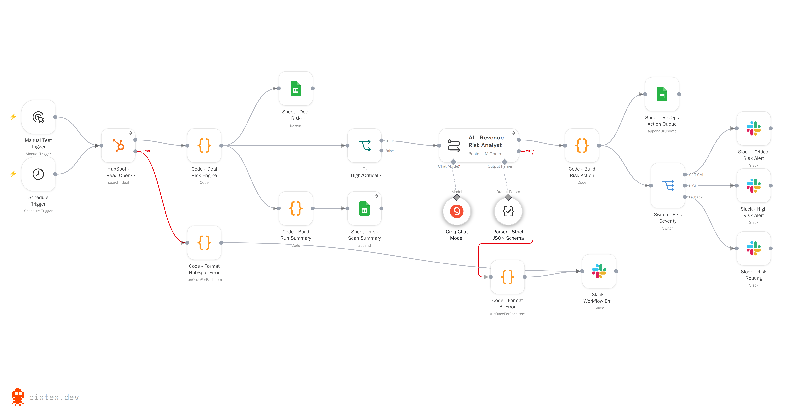

# RevOps Deal Risk Assessment & Alert System

An n8n automation that scores every open HubSpot deal each morning, explains *why* a deal is at risk, maintains an action queue in Google Sheets, and sends Slack alerts only when something has genuinely changed.

This repository contains two versions of the same system — the working draft I built first, and the version it became after a structured review — plus a shared error handler. Both versions run. Keeping both is the point: the interesting part of this project is the reasoning between them.


---

## The business problem

Sales teams can't manually inspect every open opportunity. A manager with 200 deals in the pipeline cannot check each one for stalled activity, slipping close dates, or missing next steps — so deals go quiet and nobody notices until the forecast misses.

The CRM already holds the signals. What it doesn't do is turn them into a prioritised, explained list of the handful of deals that need attention *today*. HubSpot can tell you a deal hasn't been touched in 45 days. It can't tell you that this particular deal is the one worth interrupting your morning for, and why.

That gap — between raw CRM fields and an actionable decision — is what this system fills.

---

## What the final system does

```
HubSpot  →  Load prior state  →  Score & classify  →  Decide what changed
                                                            │
                    ┌───────────────────────────────────────┼──────────────────┐
                    ↓                                       ↓                  ↓
            Audit log & summary                  Action queue + Slack      Resolution
             (Google Sheets)                      (only if changed)      (close the loop)
```

Every morning at 08:00 the workflow:

1. **Pulls all open deals** from HubSpot with the properties the risk rules need.
2. **Loads its own memory** — what it last told a human about each deal, and where each deal's close date used to be.
3. **Scores each deal** against a deterministic rubric: stalled activity, overdue and repeatedly-pushed close dates, single-threading, and CRM data gaps.
4. **Compares against the last delivered alert** and decides: alert, refresh quietly, mark resolved, or do nothing.
5. **Writes the record first, then sends Slack** — so a notification failure never loses the row.
6. **Records alert state only after Slack confirms delivery** — so a failed send means the deal re-alerts tomorrow rather than being silently suppressed forever.

---

## Version 1 — the draft

**`workflows/01-deal-risk-system-draft.json`** — 20 nodes, 5 Code nodes, Groq (`gpt-oss-120b`)

This was a working system, not a failed attempt. It ran on a schedule, scored every open deal, wrote a full audit log and a run summary, produced an AI-written risk assessment for high-risk deals, routed CRITICAL and HIGH to Slack, and maintained a `deal_id`-keyed action queue.

It also already had things many first builds skip: a structured output parser constraining the LLM's response, error outputs wired from both the HubSpot node and the AI node to a Slack error alert, and a manual trigger sitting alongside the schedule so it could be tested on demand.



**What it proved:** the business logic worked. The signals were the right signals, the scoring rubric was coherent, and a scored, explained queue was more useful to a manager than any CRM view.

**Where it ran out of road:**

- **No memory.** Nothing persisted between runs, so every at-risk deal alerted every single morning. That is how alerting systems get muted.
- **No resolution.** A deal that recovered stayed in the queue forever, with nothing marking it done.
- **Nothing happened below the threshold.** The `IF - High/Critical Risk` node's false branch connected to nothing — LOW and MODERATE deals were scored, logged, and then silently dropped.
- **Error alerts shared the risk channel.** Workflow failures went to `#revops-risk` alongside deal alerts, mixing two audiences.
- **The scoring rubric measured the wrong thing.** Verified by extracting the engine and running it — see below.

---

## Version 2 — the final

**`workflows/02-deal-risk-system-final.json`** — 32 nodes, 8 Code nodes, Gemini 2.5 Flash Lite via OpenRouter

The draft proved the concept. The review that followed found one problem I'd have never spotted by reading the code, and several I might have.

### The finding that mattered

I extracted the draft's scoring engine and ran it against constructed deal scenarios rather than assuming it worked. Both versions, same fixtures:

| Scenario | Draft | Final |
|---|---|---|
| $5M deal, no activity for 45 days | 20 · MODERATE · **silent** | 44 · HIGH · **alerts** |
| No activity for 90 days | 25 · MODERATE · **silent** | 56 · HIGH · **alerts** |
| Close date 100 days overdue | 35 · MODERATE · **silent** | 69 · CRITICAL · **alerts** |
| Close date 400 days overdue | 35 · MODERATE · **silent** | 69 · CRITICAL · **alerts** |
| Single-threaded (1 contact) | 0 · LOW · silent | 31 · MODERATE · silent |
| New lead, four CRM fields empty | 50 · HIGH · **alerts** | 0 · LOW · **silent** |
| Overdue 100d **and** stalled 90d | 60 · CRITICAL · alerts | 100 · CRITICAL · alerts |

The draft's two strongest real signals capped at 25 and 35 — both below the HIGH threshold of 40 — while four empty CRM fields summed to 50. It was a **data-hygiene alarm wearing a deal-risk label**: reliably escalating incomplete records, reliably silent about stalled revenue.

The fix was to score two things separately. Genuine deal risk (stalls, slippage, single-threading) now carries weight that can reach HIGH on its own. CRM hygiene sits in its own bucket contributing at half weight, and is suppressed entirely for deals under seven days old — because a lead created on Tuesday isn't "risky" for being incomplete on Wednesday.

### What else changed

| Finding | Change |
|---|---|
| Alerts repeated every morning | Two n8n Data Tables holding alert state and close-date history. A deal alerts only when its level changes, its issue set changes, or its score moves 5+ points. |
| Alert state committed regardless of delivery | The state write now sits **downstream of Slack's success output**. A failed send means the deal re-alerts tomorrow instead of being suppressed permanently. |
| LOW/MODERATE deals silently dropped | A four-way router: alert, refresh quietly, mark resolved, or do nothing — every deal takes exactly one path. |
| No resolution path | A resolution branch plus a reaper for deals that leave the pipeline entirely, both logging to a resolved log. |
| Deals that keep slipping were invisible | A second Data Table tracks last-seen close date and a push counter. A deal pushed across three quarters is never overdue on any given day, yet is one of the most reliable slip signals there is. |
| No buyer-side signal | Single-threading, via HubSpot's `num_associated_contacts` — no extra API call. |
| A "45 days inactive" figure you couldn't trust | The stall signal now prefers real sales activity over `hs_lastmodifieddate`, which any automation resets. The source used is recorded per row. |
| Error alerts mixed with deal alerts | A single aggregating error sink on its own channel. One message per failing node, naming the affected deal IDs. |
| Five per-item error formatters | One. A rate-limited batch of 40 deals used to produce 40 Slack messages, which then tripped Slack's own rate limit. |

---

## How I used AI

AI was a development assistant on this project, not a black box that produced a workflow.

**Analyse.** I gave the working draft to an AI model and asked for a structured audit — execution settings, expressions, data flow, failure modes, business logic. It produced findings I could check, not conclusions I had to trust.

**Verify before believing.** The scoring finding is the clearest example. The claim was "your rubric is inverted." Rather than accept it, I extracted the engine into a test harness and ran it against constructed deals. The numbers in the table above are measured output, not a review comment. That's also how I confirmed the fix worked rather than just moved the problem.

**Understand before implementing.** For every Code block proposed I worked through what it receives, what it returns, which nodes it replaces, and what happens when the input is empty or malformed — before putting it in the workflow. Where I couldn't follow the reasoning, I asked for it to be explained or simplified rather than pasting it in.

**Reject what didn't fit.** Merging the two Slack alert nodes would have removed the ability to route CRITICAL and HIGH to different channels later. Auto-reaping the close-date tracking table would have added two nodes to solve a problem that doesn't exist — a stale row there is inert. Both suggestions were declined.

**Sequence the risk.** The scoring re-weighting changes which deals alert, so it shipped separately from the pure reliability fixes. That way, if alert volume had changed unexpectedly, I'd have known exactly which change caused it.

**What this demonstrates:** I understood the business problem and designed the workflow around it, built and ran a working version, used AI to find what I couldn't see myself, tested the claims rather than trusting them, and made sure I understood each technical change before shipping it. I did not write the advanced JavaScript from scratch — I specified what it needed to do, reviewed what it did, verified the result, and rejected the parts that didn't earn their place.

---

## Draft vs final

| Area | Draft | Final |
|---|---|---|
| **Architecture** | Linear: fetch → score → filter → AI → sheet + Slack | Staged: ingest → load state → score → route four ways → alert / refresh / resolve |
| **Risk logic** | One score out of 100, everything in one bucket | Deal risk and CRM hygiene scored separately; hygiene at half weight, suppressed for deals under 7 days old |
| **Risk signals** | 10 issue codes | 15 — adds single-threading, close-date push detection, and graduated slippage bands |
| **Node count** | 20 nodes, 5 Code | 32 nodes, 8 Code |
| **State tracking** | None | Two Data Tables: alert state and close-date history, each bulk-read once per run |
| **Deduplication** | None — every at-risk deal alerted daily | Alerts only on material change: new risk, level change, different issues, or a 5+ point move |
| **Resolution** | None | Resolution branch, plus a reaper for deals that leave the pipeline |
| **Below-threshold deals** | Silently dropped | Explicitly routed to a no-op path |
| **Error handling** | Two formatters, one per source, into the risk channel | One aggregating sink naming affected deals, on its own channel, plus a shared error-handler workflow |
| **Alert delivery** | Fire and forget | State recorded only after Slack confirms the send |
| **AI failure behaviour** | An AI failure removed the deal from the alert path | Left join over the deal list: failure degrades one line of wording, never deletes an alert |
| **AI output** | Three fields (assessment, impact, action) | One field — the recommended action. The other two restated data already in the alert. |
| **Outputs** | 3 Google Sheets tabs | 5 tabs: action queue, audit log, run summary, alert log, resolved log |
| **Model** | Groq `gpt-oss-120b` | Gemini 2.5 Flash Lite via OpenRouter, temperature 0 |

---

## Key design decisions

**Scoring stays deterministic; AI writes one sentence.** Nothing downstream reads a severity from a language model. Score, level, trend and routing are computed in code. The model produces the recommended next action — the one output deterministic logic genuinely can't produce. If it fails, a driver-specific fallback fires and the alert still goes out.

**Compare against the last *alerted* state, not the last *seen* state.** A deal drifting 44 → 47 → 50 should alert on the third run — not never, and not all three times. Storing state at the point of alert rather than at last scan is what makes that work.

**Record state only after delivery is confirmed.** In the draft the state write would have run alongside the Slack send. If Slack failed, the system would still record "alerted" and suppress the deal from then on. The write now sits downstream of Slack's success output.

**Data quality is not deal risk.** A deal missing an amount is a CRM problem. A $5M deal untouched for six weeks is a revenue problem. Scoring them in one bucket meant the second was drowned out by the first.

**Preserve the evidence.** When a deal resolves, only the fields that describe its resolution are rewritten. The risk drivers and recommended action are deliberately left untouched — Google Sheets' `appendOrUpdate` leaves unmapped columns alone, so the record of *why* the deal was flagged survives its resolution.

**Write the durable record before notifying.** In n8n's v1 execution order, parallel branches run in canvas position order. The sheet write sits above the Slack branch on purpose: if the notification fails, the row still exists.

---

## What the system outputs

| Output | Where | Contents |
|---|---|---|
| **Action queue** | Google Sheets | One row per at-risk deal: owner, amount, score, level, trend, drivers, recommended action, days at risk, status |
| **Slack alert** | Slack | Deal name linked to HubSpot, owner, amount, score with level and trend, close status, why it fired, top 3 drivers, recommended action |
| **Assessment log** | Google Sheets | One row per deal per day, including the score breakdown — makes the model auditable |
| **Alert log** | Google Sheets | One row per *delivered* alert — proof of what was actually sent |
| **Resolved log** | Google Sheets | One row per resolution, distinguishing a deal that recovered from one that left the pipeline |
| **Run summary** | Google Sheets | Daily counts by risk level, total exposure, and two health metrics that flag if the model drifts |

The action queue, filtered to `action_status = REVIEW_REQUIRED` and sorted by score — the surface a manager actually works from:


The run summary builds the time series that shows whether pipeline risk is trending, and whether the scoring model is drifting:


State lives in n8n Data Tables, not in the sheets. This is what makes the system quiet — it's the memory that stops every at-risk deal alerting every morning:


---

## Example

What a manager sees in Slack:

```
🚨 CRITICAL DEAL RISK

Deal: Acme Corp - Platform Expansion
Owner: 4471029
Amount: 250,000
Risk: 75/100 (CRITICAL) · RISING
Close: 12 days overdue
Why now: RISK_LEVEL_CHANGED

Risk drivers:
• Only one contact associated, so the deal depends on a single relationship.
• No sales activity for 45 days, deal is stalling.
• Close date 12 days overdue, indicating forecast slippage.

Recommended action: Identify and engage a second stakeholder this week before advancing the deal.
```


Compare that with "this deal is at risk." The alert answers which deal, whose, how much is exposed, how serious, what specifically is wrong, **what changed since last time**, and what to do about it. `RISING` tells the manager the deal is getting worse rather than just bad — those need different responses. And because of the deduplication gate, this message only appears when something actually changed, which is what keeps the channel worth reading.

---

## Error handling

Two independent layers.

**Inline** — around twenty nodes route their error output to a single aggregating sink that collapses any number of failed items into one Slack message naming the affected deal IDs. Handles failures the workflow can catch and continue through.

**Shared error handler** (`workflows/03-shared-error-handler.json`) — a separate four-node workflow set as the Error Workflow. Catches *unhandled* failures: a node throwing, an execution timing out, a trigger breaking. It handles both Error Trigger payload shapes, clips oversized stack traces so the notification can't itself fail, and falls back to email if Slack is the thing that's down.


They're not alternatives. The inline layer covers handled errors and keeps the run green; the shared handler covers everything else and keeps the run red.

---

## Technology

- **n8n** — workflow orchestration, Code nodes, Data Tables
- **HubSpot CRM** — deal data via the CRM search API, read-only
- **Google Sheets** — action queue, audit log, alert log, resolved log, run summary
- **Slack** — alert delivery
- **JavaScript** — in n8n Code nodes, for scoring, state comparison and data joins
- **Groq `gpt-oss-120b`** (draft) → **Gemini 2.5 Flash Lite via OpenRouter** (final)
- **AI-assisted development** — used for workflow analysis and code implementation, verified before use

---

## Repository structure

```
revops-deal-risk-alert-system/
├── README.md
├── workflows/
│   ├── 01-deal-risk-system-draft.json      # v1 — working draft, 20 nodes
│   ├── 02-deal-risk-system-final.json      # v2 — production version, 32 nodes
│   └── 03-shared-error-handler.json        # shared Error Workflow, 4 nodes
├── docs/
│   ├── architecture-and-node-reference.md  # every node: what, why, how
│   └── setup.md                             # import and configuration
└── screenshots/                             # canvases, Slack alerts, sheets
```

All three files import into n8n directly. Credentials and account-specific IDs are replaced with placeholders — see `docs/setup.md`.

---

## What this project demonstrates

- Translating a real revenue-operations problem into an automation with a defined output
- Designing a risk model around business signals rather than around available data fields
- Building and running a working system in n8n, including Code nodes, AI chains and structured output parsing
- Recognising the limits of a first design, and knowing which limits actually mattered
- Testing business logic against constructed scenarios instead of assuming it works
- Using AI to analyse an existing system, while verifying its claims and rejecting what didn't fit
- Understanding n8n execution behaviour: item handling, execution order, error outputs, state persistence

---

## Limitations and future work

**Known limitations**

- Runs on a daily schedule. A deal that goes wrong at 09:00 isn't surfaced until the next morning.
- Risk signals come from HubSpot properties only. Engagement quality, email sentiment and call content would need conversation-intelligence data the system doesn't have.
- The assessment log grows by one row per deal per day. It's isolated in its own spreadsheet for headroom, but at high deal volume it will eventually need rotation.
- Owner is stored as a HubSpot ID rather than a name, which keeps the workflow to a single API call but makes the sheets less readable.
- Close-date push counts only become meaningful after a few weeks of history has accumulated.
- Deal names and amounts are sent to a third-party model for the recommended-action step.

**Possible next steps**

- Track whether the recommended action was actually taken — the most consistent recommendation in pipeline-review practice, and currently the system's biggest blind spot
- Add time-in-stage as a signal alongside activity age
- A weekly digest for resolved deals, closing the loop without adding per-event Slack noise
- Per-owner risk reporting from the assessment log
