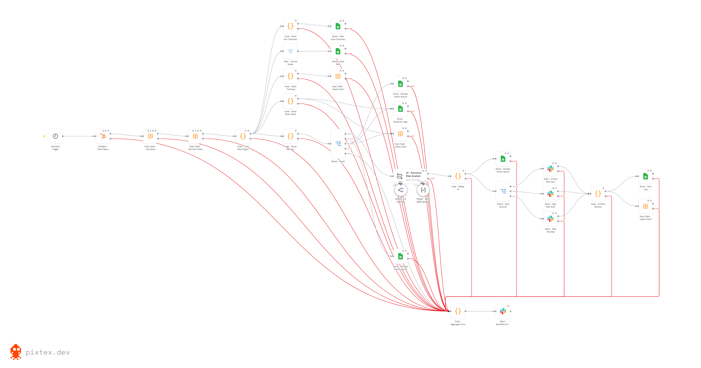
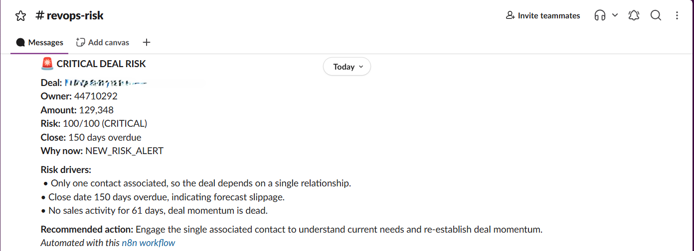

# RevOps Deal Risk Assessment & Alert System

An n8n automation that scores every open HubSpot deal each morning, explains *why* a deal is at risk, maintains an action queue in Google Sheets, and sends Slack alerts when a material risk change is detected.

> **About this project.** A self-directed portfolio build, not a client engagement. It runs end to end against a HubSpot test portal with sample deal data; it has not been deployed inside a live revenue organisation. Everything described below is implemented in the workflow files in this repository — nothing here is aspirational or planned.



---

## The problem it solves

Sales teams can't manually inspect every open opportunity. A manager with 200 deals in the pipeline cannot check each one for stalled activity, slipping close dates, or missing next steps — so deals go quiet and nobody notices until the forecast misses.

The CRM already holds the signals. What it doesn't do is turn them into a prioritised, explained list of the deals that need attention *today*. HubSpot can tell you a deal hasn't been touched in 45 days. It doesn't turn that information into a consistently scored, explainable RevOps work queue.

That gap — between raw CRM fields and an actionable decision — is what this system fills.

---

## How it works

```text
HubSpot  →  Load prior state  →  Score & classify  →  Decide what changed
                                                            │
                    ┌───────────────────────────────────────┼──────────────────┐
                    ↓                                       ↓                  ↓
            Audit log & summary                  Action queue + Slack      Resolution
             (Google Sheets)                      (only if changed)      (close the loop)
```

Every morning at 08:00:

**1. Pull every open deal.** Filtered on HubSpot's computed closed-status property rather than default-pipeline stage IDs, so deals in custom pipelines are handled correctly.

**2. Load the system's own memory.** Two n8n Data Tables hold what was last communicated about each deal, and where each deal's close date used to sit.

**3. Score each deal** against a deterministic rubric across four signal families:

| Signal family      | What it catches                                          |
| ------------------ | -------------------------------------------------------- |
| **Momentum**       | No meaningful sales activity for 14 / 30 / 60+ days      |
| **Slippage**       | Overdue close dates and repeated close-date pushes       |
| **Buyer coverage** | Single-threaded deals with only one associated contact   |
| **Data quality**   | Missing amount, owner, next step, close date or contacts |

Deal risk and data quality are scored in **separate buckets**. Revenue risk therefore remains distinct from CRM hygiene, while the data-quality score still provides a useful measure of record completeness.

A seven-day age guard prevents very new deals from being treated as materially risky simply because their CRM record has not yet been fully populated.

**4. Classify the current state.** Each deal receives a risk score, risk level, trend and structured issue information. The workflow also preserves the individual drivers behind the score so the result can be explained rather than treated as a black-box severity.

**5. Decide what changed.** The current state is compared with the last state that was actually communicated. Depending on the result, the deal can generate a new alert, update its operational record without creating notification noise, be marked as resolved, or remain unchanged.

**6. Write the record, then notify.** The Google Sheets record is written before the Slack message fires, so a notification failure never loses the underlying assessment record.

**7. Commit alert state only on confirmed delivery.** Alert state is written downstream of Slack's success output. A failed send means the deal is not silently marked as communicated.

---

## Risk model & decision framework

The system is designed around a simple principle:

> **Risk should explain where revenue may be at risk, while data quality should explain where the CRM record needs attention.**

### Deal-risk signals

The core risk score focuses on conditions that indicate loss of momentum, forecast instability or insufficient buyer coverage.

Examples include:

* prolonged inactivity
* overdue close dates
* repeated close-date pushes
* single-threaded buyer relationships
* combinations of multiple risk drivers

The scoring engine produces both a **numeric score** and a **risk level**:

```text
LOW → MODERATE → HIGH → CRITICAL
```

The workflow also records the individual issue codes and drivers that produced the result.

### Data-quality signals

CRM completeness is deliberately measured separately.

Examples include:

* missing amount
* missing owner
* missing next step
* missing close date
* missing contact coverage

This prevents a collection of empty CRM fields from automatically being interpreted as equivalent to genuine deal deterioration.

### Explainability

Every assessment preserves supporting evidence rather than only the final score.

The assessment log records:

* risk score
* previous risk score
* risk level
* previous risk level
* risk trend
* deal-risk score
* data-quality score
* issue fingerprint
* issue codes
* risk drivers
* score breakdown
* activity source
* execution ID

That makes the output auditable: a reviewer can trace a risk classification back to the conditions that produced it.

---

## What an alert looks like

```text
🚨 CRITICAL DEAL RISK

Deal: Acme Corp - Platform Expansion
Owner: 4471029
Amount: 250,000
Risk: 75/100 (CRITICAL) · RISING
Close: 12 days overdue
Why now: RISK_LEVEL_CHANGED

Risk drivers:
• Only one contact associated, so the deal depends on a single relationship.
• No sales activity for 45 days, deal is stalling.
• Close date 12 days overdue, indicating forecast slippage.

Recommended action: Identify and engage a second stakeholder this week before advancing the deal.
```



The alert is designed to answer which deal, whose, how much is exposed, how serious it is, what specifically is wrong, **what changed**, and what action should be considered.

The alert also distinguishes between the current risk state and the event that caused notification, such as a new risk, changed issue set or changed risk level.

---

## What it outputs

| Output             | Where         | Contents                                                                                                                         |
| ------------------ | ------------- | -------------------------------------------------------------------------------------------------------------------------------- |
| **Action queue**   | Google Sheets | Operational work queue containing deal, owner, amount, score, level, trend, drivers, alert reason, recommended action and status |
| **Slack alert**    | Slack         | Linked deal name, owner, amount, score with level, why it fired, risk drivers and recommended action                             |
| **Assessment log** | Google Sheets | One assessment row per deal evaluation, including score breakdown and issue codes                                                |
| **Alert log**      | Google Sheets | One row per delivered alert, including alert reason, issue fingerprint, action source and execution ID                           |
| **Resolved log**   | Google Sheets | Resolution-history records for deals that leave or change out of the tracked risk state                                          |
| **Run summary**    | Google Sheets | Run-level counts by risk level, high-value risk count, missing-close count, single-threading count and high/critical exposure    |

The action queue is the operational surface a sales or RevOps user would work from:


The run summary provides a historical view of scan results:


State lives in n8n Data Tables, not in the sheets. This allows the workflow to distinguish the current assessment from the last state that was actually communicated.


---

## Test-run evidence

The Google Sheets outputs provide concrete evidence from the HubSpot test portal rather than only describing the intended architecture.

### Latest completed risk scan

The latest populated summary run is **execution 92**, which scanned **48 open deals**:

| Metric                   | Execution 92 |
| ------------------------ | -----------: |
| LOW                      |           26 |
| MODERATE                 |            4 |
| HIGH                     |           10 |
| CRITICAL                 |            8 |
| High-value risk count    |           16 |
| Missing close date       |            4 |
| Single-threaded deals    |            7 |
| HIGH + CRITICAL exposure |   $4,470,160 |
| Data-quality-only count  |            0 |

That means **18 of 48 deals were classified HIGH or CRITICAL** in that run, with **$4.47M** of associated high/critical exposure.

The detailed assessment log contains **268 assessment records covering 72 unique deals** across the available test history.

Each assessment preserves the scoring and evidence behind the classification rather than only the final severity.

### Alert history

The Alert Log currently contains **26 delivered alerts**:

| Alert reason          | Count |
| --------------------- | ----: |
| `NEW_RISK_ALERT`      |    18 |
| `RISK_ISSUES_CHANGED` |     6 |
| `RISK_LEVEL_CHANGED`  |     2 |

This provides a useful audit trail of *why* an alert was delivered rather than only recording that a notification happened.

The recorded alerts were sent to the configured `#revops-risk` channel.

### Action queue

The current action queue contains **33 records**:

| Status            | Count |
| ----------------- | ----: |
| `REVIEW_REQUIRED` |    31 |
| `RESOLVED`        |     2 |

The queue records operational context including deal, owner, amount, score, risk level, trend, drivers, alert reason, recommended action and status.

This makes the sheet useful as a **RevOps work queue**, rather than simply another copy of the scoring output.

### Resolution log

The repository also includes a `Resolved Log` sheet containing resolution-history records.

The current sample demonstrates the resolution path, but the test data does not populate every resolution field consistently. It is therefore treated as an **audit/history layer**, not as a full case-management system.

---

## Key design decisions

**Scoring stays deterministic; AI writes one sentence.** Nothing downstream reads severity from a language model. Score, level, trend and routing are computed by the workflow. The model produces the recommended next action — the part that benefits from language generation while keeping business-critical decisions deterministic. If it fails, a driver-specific fallback fires and the alert can still be delivered.

**Compare against the last *alerted* state, not simply the last *seen* state.** The system retains the state that was actually communicated. This allows it to distinguish a newly material risk from an unchanged risk that has simply been observed again.

**Record alert state only after delivery is confirmed.** If the state write ran alongside Slack, a failed notification could still mark a deal as already communicated. The state update therefore happens downstream of Slack's successful output.

**Data quality is not deal risk.** CRM completeness problems and revenue-risk conditions represent different operational problems. Keeping their scores separate prevents routine data hygiene issues from obscuring genuine deal deterioration.

**Preserve evidence through the lifecycle.** Risk drivers, issue codes and score information are retained in the assessment history so that later review does not depend on reconstructing what the system saw at the time.

**Write the durable record before notifying.** The workflow deliberately records the operational assessment before entering the notification path, so an alerting failure does not erase the fact that the risk was detected.

**A left join, not a map.** `Code - Merge AI` iterates the *deal list*, not the AI responses. If the AI step fails for one deal, that deal remains in the result and can use fallback wording rather than disappearing from the risk pipeline.

---

## Error handling

Two independent layers.

**Inline** — around twenty nodes route their error output to a single aggregating sink that collapses any number of failed items into one Slack message naming the affected deal IDs. Covers failures the workflow can catch and continue through.

**Shared error handler** (`workflows/03-shared-error-handler.json`) — a separate four-node workflow set as the Error Workflow. Catches *unhandled* failures: a node throwing, an execution timing out, a trigger breaking. It handles both n8n Error Trigger payload shapes, clips oversized stack traces so the notification can't itself fail, and falls back to email if Slack is the thing that's down.


They aren't alternatives. The inline layer covers handled errors and keeps the run green; the shared handler covers everything else and keeps the run red.

---

## How the system was developed

This project was built as an iterative engineering exercise rather than treating AI output as an unquestioned implementation.

AI was used to review the workflow, inspect execution behaviour, identify possible failure modes, and suggest implementation approaches. Those suggestions were then checked against the actual n8n workflow, data flow and expected outputs.

The development process focused on four questions:

**Does the logic match the business problem?**
A scoring rule was only accepted when its outcome made sense from a RevOps perspective.

**Can the behaviour be explained?**
Risk classifications need observable drivers and supporting evidence rather than an unexplained number.

**What happens when something fails?**
The design explicitly considers AI failure, Slack failure, node errors, empty results and partial execution.

**Does every record have a safe path through the workflow?**
The workflow is designed so that a failed optional AI step does not remove the underlying deal from assessment or alert processing.

I did not write the advanced JavaScript from scratch. I specified what it needed to do, read through what it did, checked the logic against what I wanted the system to produce, and rejected the parts that didn't earn their place.

---

## Technology

* **n8n** — workflow orchestration, Code nodes, Data Tables
* **HubSpot CRM** — deal data via the CRM search API, read-only
* **Google Sheets** — action queue, assessment log, alert log, resolved log, run summary
* **Slack** — alert delivery
* **Gemini 2.5 Flash Lite via OpenRouter** — one generated field per alerted deal
* **AI-assisted development** — used for workflow analysis and implementation support, verified before use

---

## Repository structure

```text
revops-deal-risk-alert-system/
├── README.md
├── workflows/
│   ├── 01-deal-risk-system-draft.json
│   ├── 02-deal-risk-system-final.json
│   └── 03-shared-error-handler.json
├── docs/
│   ├── architecture-and-node-reference.md
│   └── setup.md
└── screenshots/
```

All three workflow files import into n8n directly. Credentials and account-specific IDs are replaced with placeholders — `docs/setup.md` lists every value to substitute, the Sheets tabs and columns to create, and the Data Table schemas.

---

## What this project demonstrates

* Translating a revenue-operations problem into an automation with a defined operational output
* Designing a risk model around business signals rather than around whichever CRM fields happen to be available
* Separating revenue risk from CRM data quality
* Building explainable risk scoring with structured drivers and issue codes
* Creating an operational work queue rather than only generating notifications
* Maintaining persistent workflow state for change detection
* Designing alerting around meaningful changes instead of repeated static notifications
* Preserving an auditable assessment and notification history
* Handling AI failure without allowing the AI step to become a single point of failure
* Using AI to analyse and improve a technical system while verifying its claims before implementation
* Understanding n8n execution behaviour: item handling, execution order, error outputs and state persistence

---

## Limitations

Stated plainly, because a portfolio project that claims no weaknesses isn't credible.

* **The thresholds are reasoned, not calibrated.** Weights and bands are based on business reasoning and have not been validated against real closed-won / closed-lost outcomes. In a real deployment, historical outcome data would be used to calibrate the model.
* **Tested against sample data, not a live pipeline.** It runs against a HubSpot test portal and has not been through the full range of messy real-world CRM conditions.
* **Daily cadence.** A deal that changes materially at 09:00 isn't surfaced by this scheduled process until the next morning.
* **CRM signals only.** Engagement quality, email sentiment and call content would require additional conversation-intelligence data.
* **The assessment log grows** by one row per deal per evaluation. In the current test data it contains 268 records across 72 unique deals; at higher volume it would need retention or archival.
* **Owner is stored as a HubSpot ID**, not a name, which keeps the workflow to the available data without an additional owner lookup.
* **Close-date push counts** become more meaningful as historical executions accumulate.
* **The current resolved-log sample is incomplete.** The resolution path exists, but several resolution fields are not populated consistently in the test data.
* **Deal names and amounts are sent to a third-party model** for the recommended-action step.

### If I took it further

* Calibrate the scoring weights against historical win/loss data
* Track whether the recommended action was actually taken
* Add time-in-stage as a signal alongside activity age
* Resolve HubSpot owner IDs to readable names in the operational sheets
* Add a weekly digest for resolved deals
* Add retention/archival for long-term assessment history
